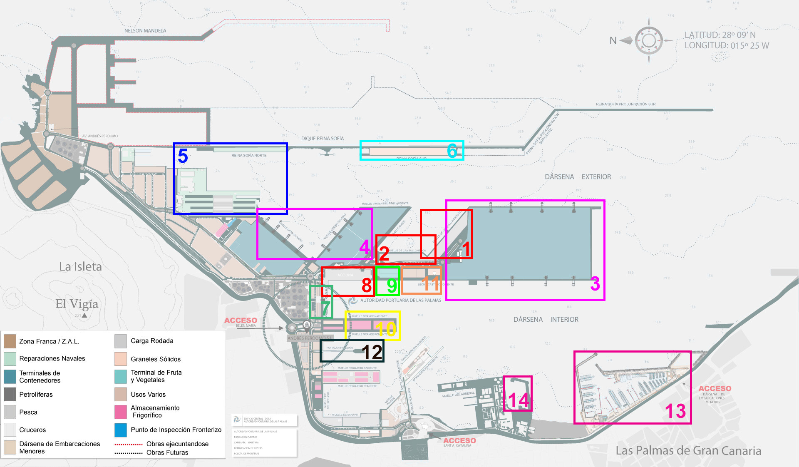

```{r libraries, message=FALSE, warning=FALSE, include=TRUE}
library(tidyverse)
library(lubridate)
library(geosphere)
library(tools)
library(gridExtra)
library(ggthemes)
library(Matrix)
library(rstudioapi)
library(leaflet)
library(reshape2)
library(arules)
# library(mapview)
source("define functions.r")
options(dplyr.show_progress = FALSE)
options(scipen = 999)
categories <- c("Bulk Carrier", "Fishing Vessel", "High Speed Craft", 
                "General Cargo ", "Container Ship", "Port Tender", "Tanker",
                "Passenger", "Pleasure Craft")
thm <- NULL
```

## Importing and pre-processing the data from points to trips
### Import
First we load two data sets: 

1. AIS measurements captured within a 15km radius of Las Palmas.
2. Vessel-information data.

During the import process we already remove invalid and insufficient
measurements (e.g. duplicate data). This affected aproximately 12% of the data 
imported. Each measurement is then labelled with a new position id to make each
data row uniquely identifiable (*POSID*).

*Note: (1) Had already seen some pre-processing in R and QGIS. (2) Was scraped
from Marinetraffic and relevan data was extracted using regular expressions.
```{r load ais, echo=TRUE, message=FALSE, warning=FALSE, results=TRUE}
vesseldetails <- read_csv('dataset/in/df_vesseldetails_original.csv')
aisdata <- read_csv('dataset/in/df_1d_selection_restricted.csv') 

tmp_noimp <-  nrow(aisdata)
aisdata <- aisdata %>% 
  subset(select = -c(1,2)) %>%  #TODO Change to name selection and drop xy col
  filter(MMSI %in% vesseldetails$MMSI) %>%
  subset(!duplicated(select(.,MMSI,TIMESTAMP))) %>% 
  group_by(MMSI) %>% 
  filter(n() > 10) %>%
  ungroup() %>%
  arrange(MMSI,TIMESTAMP) %>% 
  mutate(POSID = row_number(x = .$MMSI))
cat(' Number of AIS measurements available:',tmp_noimp,
    '\n','Number of valid AIS measurements imported:', nrow(aisdata))
```
If we were to plot a small sample on a map this is how it looks like. 

```{r, eval=FALSE, message=FALSE, warning=FALSE, include=FALSE}
set.seed(1234)
ships_to_plot <- sample(unique(aisdata$MMSI), 10)
sample_df <- filter (aisdata, MMSI %in% ships_to_plot)
m <- leaflet() %>%
  addTiles() %>%  # Add default OpenStreetMap map tiles
  addCircleMarkers(lng=sample_df$LON, lat=sample_df$LAT,
    radius = 3,
    color = "red",
    stroke = FALSE, fillOpacity = 0.6
  )
m
```

### Create tracks
The plot below shows three different representations of the AIS data. In the 
'Points' plot on the left we see the orignal data representation: a collection 
of GPS coordinates pertaining to a particular vessel.

In the 'Tracks' plot in the center the points have been transformed into a 
navigationpath where segments are connected in chronological order. Moreover 
both for the overall track as well as each segment characteristic are computed. 
E.g. the duration or length of a segment. These transformations are implemented 
within the `Points2Trajectory()` function below.

On the right plot further transformations were carried out. Here a vessel's 
trajectory is broken up into two 'trips' which occured on two different days. 
The trip colored in red occured on the 5th of June 2014, while the trip colored 
in blue occured on the 26th of June 2014. This is necessary because not doing so
leads to  problems such as sudden jumps in the vessel-position (visible from the
straight diagonal line in the Tracks plot). The transformation from a  vessel 
trajectory to trips is implemented in the `Trajectory2Trips()` function  further
below. The functions goes even one step further and subdivides trips occuring at
different days into outbound and inbound trips.

```{r plot point-traj-trips, echo=FALSE, message=FALSE, warning=FALSE}
tmp <- filter(aisdata, MMSI == 224548000, LON > -15.44 , LON < -15.37) %>% 
  mutate(daytrip = as.factor(day(TIMESTAMP)))
tmp_p1 <- ggplot(tmp) +
  geom_point(aes(LON, LAT)) + thm +
  ggtitle('Points') + coord_fixed()
tmp_p2 <- ggplot(tmp) + 
  geom_point(aes(LON, LAT)) + 
  geom_path(aes(LON, LAT)) + thm +
  ggtitle('Trajectory') + coord_fixed()
tmp_p3 <- ggplot() + 
  geom_point(data = tmp, aes(LON, LAT, color = daytrip)) +
  geom_path(data = tmp, aes(LON, LAT, color = daytrip)) + thm +
  ggtitle('Trips') + theme(legend.position = 'none') + coord_fixed() +
  scale_colour_brewer(palette = "Set1")
plot_point_tracks <- grid.arrange(tmp_p1, tmp_p2, tmp_p3, ncol = 3, nrow = 1) + 
  theme(plot.margin=grid::unit(c(0,0,0,0), "mm"))
# plot_point_tracks
RemoveObjects('tmp')
```

Here we transform the point representation into a trajectory representation as 
explained before. Very importantly we calculate the duration of each segment on
the trajectory as well as the average speed and bearing. 
```{r create trajectories, message=FALSE, warning=FALSE, results=FALSE}
Points2Trajectory <- function(df){
  df <- df %>% arrange(TIMESTAMP)  
  idx1 <- seq(1, nrow(df) - 1, 1)
  idx2 <- seq(2, nrow(df), 1) 
  startpoints <- slice(df,idx1) %>% select(START_LON = LON, START_LAT = LAT)
  endpoints <- slice(df,idx2) %>% select(END_LON = LON, END_LAT = LAT)
  start_time <- slice(df,idx1) %>% .$TIMESTAMP
  end_time <- slice(df,idx2) %>% .$TIMESTAMP
  data.frame(slice(df,idx1) %>% select(MMSI),
             slice(df,idx1) %>% select(START_POSID = POSID),
             slice(df,idx2) %>% select(END_POSID = POSID),
             TIME_START = start_time,
             TIME_END = end_time,
             startpoints,
             endpoints,
             DISTANCE = distCosine(startpoints, endpoints),
             BEARING = bearing(startpoints, endpoints),
             TIME_DIFF = as.numeric(end_time - start_time, units = "secs")
             ) %>% 
  mutate(AVG_SPEED = DISTANCE / TIME_DIFF,
         TIME_DIFF_MIN = round((TIME_DIFF/60)))
}
trajectories <- aisdata %>% group_by(MMSI) %>% 
  do(Points2Trajectory(.)) %>% as.data.frame()
head(trajectories)
```
### Detect trips
We divide each vessel's trajectory into a collection of trips. We do this based 
on the time difference between subsequent location measurements. In other words,
if the time difference between two measurements exceeds a certain value, then it
is assumed that the current vessel's trip has ended and a new trip has started.
This may be the case when a vessel either leaves the port area or turns off its
AIS transmitter.

But first we must determine the time threshold above which a trajectory needs to
be split or not. We do this by plotting the proportion of time differences
observed between each measurement using a subselection of the data.

This subselection of data contains only vessels in the immediate proximity of
the port of Las Palmas. By doing so we are more likely to have data where the
time difference is unaffected by undesired factors (e.g. signal disturbances).
Nonetheless this subselecton covers 75% of the measurements in the data set.
(TODO insert ref on better signal near coasts) and therefore unbiased.


```{r plot time-diffs, echo=FALSE, message=FALSE, warning=FALSE}
# Temporary subselection of data
tmp_trajectories_port <- trajectories %>%
  filter(START_LON > -15.45, START_LON < -15.37)  %>%
  filter(START_LAT > 28.1, START_LAT < 28.1507) %>%
  filter(END_LON > -15.45, END_LON < -15.37)  %>%
  filter(END_LAT > 28.1, END_LAT < 28.1507) %>%
  filter( (day(TIME_START) - day(TIME_END)) < 2 )  # To avoid day jumps.

# Discard uncommon measurements
tmp_counts <- tmp_trajectories_port  %>% 
  count(TIME_DIFF_MIN) %>%
  mutate(prop = n/sum(n)*100) %>% 
  filter(prop > .5)

# Plot time differentials
plot_tdiff <- ggplot(data = tmp_counts) +
  geom_col(mapping = aes(x = TIME_DIFF_MIN, y = prop)) +
  scale_x_continuous(breaks = seq(1:32)) +
  ylim(0, 35) +
  thm + 
  labs(title = paste("Time difference between measurements. \nn = ", 
                     nrow(tmp_trajectories_port), 
                     'with',round(sum(tmp_counts$prop),1),'% of the data shown'), 
       x = "Time between subsequent measurements (minutes)", 
       y = "Proportion of data (%)") +
  geom_label(aes(label = paste(round(prop,1),'%'), x = TIME_DIFF_MIN, y = prop + 1 ),
             vjust = 0.5, size = 3, label.padding = unit(0.15, "lines")) +
  theme(panel.grid.major.x = element_blank(), 
        panel.grid.minor.x = element_blank(), 
        panel.grid.minor.y = element_blank())
plot_tdiff
RemoveObjects('tmp')
```
The plot above shows in what time intervals the vessels position measurements
are updated as well as the proportion of measurements occurring at a given time
interval. For instance we can see that 32.5% of the measurements occur in 21
minute intervals. Overall for 96.1% of the sampled data less than 30 minutes
pass between subsequent measurements. *Footnote: Note that sampling rates that
occur in less than 0.5% of the sampled data were excluded.*

We can see that the most frequent time intervals are concentrated within a small 
range of values. In other words most position measurement occur within 2 minutes 
and 4 minutes or within 20 minutes and 24 minutes.

Importantly, 63% of measurements occur within a 20 to 24 minute interval. This
is in stark contrast to the nominal AIS reporting intervals which typically are
either every 3 minutes or every 10 minutes. (Source:
http://arundale.com/docs/ais/ais_reporting_rates.html). A possible reason for
this could be that the data provided by Greenpeace had been sampled down to
include fewer updates.

There are two takeaways from this. First, we set the time treshold to determine 
where to split the trajectory into separate trips at 30 minutes. Second, the 
rather long measurement intervals determine the machine learning methods that
can realistically be used for classifying vessels based on their navigation
data. For instance methods relying on the geometric properties of a trajectory
may be less suitable because sparse measurements also mean that the geometry of
a vessel will not be very well described.

Next we split the trajectory data into separate trips according to the 30 minute
time threshold we have just determined. For this we have written a function
`Trajectory2Trips()` which does this for us.

```{r trips function}
Trajectory2Trips <- function(df){
  # TODO SORT BY TIME
  result <- c(1:nrow(df))
  # 30 Minute time threshold determined before in seconds
  threshold <- 30*60
  counter <- 1
  for (i in 1:nrow(df)) {
    if (df$TIME_DIFF[i] <= threshold){
      result[i] <- counter  
    }else{
      result[i] <- -1
      counter <- counter + 1
    }
  }
  data.frame(result)
}
```

We apply the `Trajectory2Trips()` function to the dataframe and save the result 
in a new dataframe `trips`. Now that the data is in the correct format we can 
carry out some exploratory data analysis.

Next we remove those segments were the trips have been split. We also remove all
trips with less than 2 segments because we found that those trips had too few
datapoints to be in any way insightful.

```{r create trips}
# Convert trajectories into trips
trips <- trajectories %>% 
  group_by(MMSI) %>% # TODO THIS PROBABLY NEEDS TO STAY ON BUT WAS OFF UNTIL 30.05
  do(Trajectory2Trips(.)) %>% 
  as.data.frame() %>% 
  select(result) %>% 
  cbind(trajectories)
colnames(trips)[1] <- "TRIP_ID"

# Remove invalid trips (where there is a large time gap)
trips <- filter(trips, TRIP_ID > -1)

# Create unique ids for each Trip-MMSI combination
tmp <- trips[c("TRIP_ID", "MMSI")] %>% distinct()
tmp <- mutate(tmp, TRIP_ID_NEW = seq(1:nrow(tmp)))
trips <- left_join(trips, tmp, by=c('TRIP_ID', 'MMSI'))
trips$TRIP_ID <- trips$TRIP_ID_NEW
trips <- subset(trips, select = -c(TRIP_ID_NEW))

# Only keep trips with at least 5 segments.
tmp_to_keep <- trips %>% count(TRIP_ID) %>% filter(n > 5) %>% .$TRIP_ID
trips <- filter(trips, TRIP_ID  %in% tmp_to_keep)
rm(tmp_to_keep, tmp)
```
### Recoding vessel categories
As explained in the introduction a curated list of vesseltypes was used instead
of the crude vessel categorisation provided by the AIS devices themselves.
Furthermore the categorisation was further refined by recoding some of the
categories.
```{r recode vessel categories}
vesseldetails$VESSEL_TYPE <- dplyr::recode(vesseldetails$ship.type,
                                   "Sailing Vessel" = "Pleasure Craft",
                                   "Passengers Ship" = "Passenger",
                                   "Ro-Ro/Passenger Ship" = "Passenger",
                                   "Ro-Ro Cargo" = "Passenger",
                                   "Crude Oil Tanker" = "Tanker",
                                   "Oil Products Tanker" = "Tanker",
                                   "Chemical Tanker" = "Tanker",
                                   "Oil/Chemical Tanker" = "Tanker",
                                   "LPG Tanker" = "Tanker",
                                   "Fishing" = "Fishing Vessel")
# Let's also add the vessel.type column to the trips dataframe. 
trips <- left_join(trips, vesseldetails[,c('MMSI', 'VESSEL_TYPE')], by = 'MMSI')
trips$VESSEL_TYPE <- as.factor(trips$VESSEL_TYPE)
head(trips)
```


## Data Transformation and Feature Engineering
### Introduction
Vessel trajectories are not just some geometric shapes existing in a vacuum. 
First, they have specific properties relating to the vessel creating the 
trajectory. For instance the speed of the vessel across the trajectory or the 
time of travel. 

Second, they exist in spaces with their own semantics. For instance vessels 
often travel along sea lanes and they dock in harbours or specific docking 
areas. Because different type of vessels often dock at different locations
within a port and travel on different sea leanes such information is
particularly helpful within a vessel classification setting. Indeed previous
research has shown that adding domain knowledge to trajectory data can
significantly increase classification accuracy (Vries, 2012, p.87).

In this section I describe the feature engineering steps I undertook in order to
add domain knowledge to the trajectories and to extract intrinsic
trajectory-properties from the data.

### Adding domain knowledge
The density maps I have described before show that vessels dock at differen 
locations within the port of Las Palmas. With the help of a overview plan from 
the port of Las Palmas the 15 semantic areas pictured below were defined. Areas 
such as area 3 and area 4 denote container docks where areas such as area 13 and
area 14 indicate port areas that are solely reserved to passenger and/or sailing
vessels. 

{width=100%}

The boundaries and their geographic coordinates were defined in a spreadsheet
and subsequently imported into R. Overlapping areas (e.g. area 1 and area 3)
were corrected using set operations. For each segment in the previously
generated `trips` dataframe we check if the segment is within in any of the
defined port areas. We record the results in a sparse matrix [#segments x #areas
] and export the data.

```{r create locmat, eval=FALSE, message=FALSE, warning=FALSE, include=TRUE}
# Note this code is very slow (run time ~5 minutes), do not run but rather load
# the the sparse matrix in the next block. TODO: rewrite using for loop.
tmp_positions <-  c('START_LON', 'START_LAT', 'END_LON', 'END_LAT')
areas = read_csv('./dataset/in/areas.csv')
locmat_sparse <- apply(trips[tmp_positions],1, function(x){
  tmp_vec <- rep(0, nrow(areas))
  indeces <- intersect(filter(areas, lon_left <= x['START_LON'],
                              x['START_LON'] <= lon_right,
                              lat_bottom <= x['START_LAT'],
                              x['START_LAT'] <= lat_top) %>% .$area_code,
                       filter(areas, lon_left <= x['END_LON'],
                              x['END_LON'] <= lon_right,
                              lat_bottom <= x['END_LAT'],
                              x['END_LAT'] <= lat_top) %>% .$area_code)
  tmp_vec[indeces] <- 1
  tmp_vec
  }) %>% t %>% Matrix(locmat, sparse = TRUE)

# Fix area 3 which overlaps area 1. (avoid double counting)
locmat_sparse[,3] <- (locmat_sparse[,3] - locmat_sparse[,1])
locmat_sparse[locmat_sparse[,3] == -1,3] <- 0
writeMM(locmat_sparse, file = './dataset/in/locmat_sparse.txt')
rm(tmp_positions)
```

Once we know which segments of a vessels trips are in which area we can compute
for each vessel, for each trip the total time spent in the respective areas
defined.

```{r time-in-area,warning=FALSE, message=FALSE}
# Load areas and locmat again (previous codeblock is usually not run).
areas <- read_csv('./dataset/in/areas.csv')
locmat_sparse <- readMM(file = './dataset/in/locmat_sparse.txt')

# For each trip compute time spent in each area, return list of df. TODO: change
# into for loop.
time_in_area_list <- apply(locmat_sparse, 2, function(x)
  trips %>% 
    select(TRIP_ID, MMSI, TIME_DIFF, START_POSID) %>%
    slice(which(x != 0)) %>%
    group_by(TRIP_ID) %>% 
    summarise(total_time = sum(TIME_DIFF)) %>% 
    data.frame())

# In the previous list of df rename the total_time column.
time_in_area_list <- lapply(seq_along(time_in_area_list), function(x){
  df <- data.frame(time_in_area_list[x])
  names(df)[-1] <- paste('area',x,sep = '_')
  df
})

# Join all those list together to get 1df with total time spent in each area.
time_in_area <- time_in_area_list %>%
  Reduce(function(df1,df2) full_join(df1, df2, by = "TRIP_ID"), .) %>% 
  arrange(TRIP_ID)
time_in_area <- left_join(time_in_area, distinct(trips[c('TRIP_ID')]),
                          by='TRIP_ID')

time_in_area_long <- gather(time_in_area, statistic, value, area_1:area_15,
                            factor_key=TRUE) %>% 
  filter(value>= 0) %>%
  left_join(distinct(trips[c("TRIP_ID", "MMSI", "VESSEL_TYPE")]), by="TRIP_ID")
rm(time_in_area_list)
```

It is also useful to know which segments of a vessel's trips are outside the 
port area and which ones are inside. For instance when comparing the average 
speed across different types of vessels it makes sense to do this only on those 
parts of a trajectory that are outside the port area. The reason bein that 
within the port areas all vessel are required to abide to speed limits and 
therefore navigate at similar speeds. In contrast on open water vessels are 
allowed to navigate at their full speed and consequently allow us to 
discriminate between high speed vessels and slow sailing vessels just to mention
a few. For this purpose we create a new binomial feature in `trips` indicating
which segments are within the port area and which outside.
```{r add info on time in port}
trips <- mutate(trips, IN_PORT = as.factor(locmat_sparse[,15]))
levels(trips$IN_PORT) <- c("Outside Port", "In Port")
trips <- cbind(trips, as.data.frame(as.matrix(locmat_sparse))) 
```

Finally we create a filtered set of the trips dataframe since we are only 
interested in the vessel of the type specified in categories. 
```{r Ony keep keep small number of vessels}
trips_fl <- filter(trips, VESSEL_TYPE %in% categories)
rm(trips)
```

### Computing trip statistics 
Here we calculate various trip statistics to be used as features. We also add
the statistics concerning the time spent in each area. We express the time spent
in each area as a proportion of the total trip duration as well as absolute time.

Furthermore we add information of the proportion of activity spent at which
hour of the day. We bin the hours into morning, afternoon, evening, night in order
to reduce the number of variables This is necessary because as we will see later
there does not seem to be enough variation otherwise given the relatively small
amount of data that is available.

Finally we add information on whether the trip was carried out during a weekday
or a weekend. Similar as before just looking at the individual days did not seem
to be conclusive enough. 
```{r}
# Calculate general vessel statistics and add time in area. 
trips_stats <- group_by(trips_fl, TRIP_ID, MMSI, VESSEL_TYPE) %>% 
  summarize(duration_total = sum(TIME_DIFF),
            duration_segment = mean(TIME_DIFF),
            speed_avg = mean(AVG_SPEED),
            speed_max = max(AVG_SPEED),
            speed_upperquartile = quantile(AVG_SPEED, .90),
            distance_total = sum(DISTANCE),
            distance_segment = mean(DISTANCE),
            time_diff_avg = mean(TIME_DIFF),
            hour_min = min(hour(TIME_START)),
            hour_max = max(hour(TIME_END)),
            day_min = min(wday(TIME_START)),
            day_max = max(wday(TIME_END))) %>%
  ungroup() %>% 
  left_join(x=., y = time_in_area, by = "TRIP_ID")
trips_stats[is.na(trips_stats)] <- 0

# Calculate average speed outside port
tmp_speed_out <- filter(trips_fl, IN_PORT == "Outside Port") %>% 
  group_by(TRIP_ID) %>% 
  summarize(speed_avg_out = mean(AVG_SPEED))

# Convert time in area variables into proportion of trip duration 
# spent in area. Add to dataframe.
tmp <- lapply(trips_stats[,grep("^area_", names(trips_stats))], 
       function(x) x/trips_stats$duration_total ) %>% data.frame()
colnames(tmp) <- paste(names(tmp),"_p") %>% gsub(" ", "", .)
trips_stats <- cbind(trips_stats, tmp)
rm(tmp)

# Add information on proportion of trip activity (when the vessel is moving) spent 
# at which time period of the day. (e.g .morning, afternoon, etc.). 
# Define labels and categories
day_labels <- c("Night", "Morning", "Afternoon", "Evening")
day_categories <- c(0,6,12,18,24)
# Calculate amount of time spent at which hour 
tmp_hour <- filter(trips_fl, AVG_SPEED >= 0.5) %>% 
  select(TRIP_ID, MMSI, TIME_END) %>% 
  mutate(hour_bin = discretize(hour(TIME_END), method="fixed",
                               categories = day_categories, labels = day_labels)) %>% 
  select(-(TIME_END)) %>% group_by(TRIP_ID) %>% count(hour_bin)
# Add up total time for each group and get convert to proprtion
tmp_groupcount <- tmp_hour %>% group_by(TRIP_ID) %>% summarise_at("n",sum)
tmp_hour_prop <- left_join(tmp_hour, tmp_groupcount,by = "TRIP_ID") %>% 
  mutate(prop = n.x / n.y) %>% 
  select(TRIP_ID, hour_bin, prop) %>% 
  spread(key="hour_bin",value="prop") %>% 
  round(3)
tmp_hour_prop[is.na(tmp_hour_prop)] <- 0


# Add information on proportion of trip activity (when the vessels is moving)
# spent during a weekday vs. the weekend (Saturday, Sunday). 
# Define labels and categories
wday_labels <- c("In-week", "Weekend")
wday_categories <- c(1,5,7)
# Calculate amount of time spent at which day 
tmp_day <- filter(trips_fl, AVG_SPEED >= 0.5) %>% 
  select(TRIP_ID, MMSI, TIME_END) %>% 
  mutate(day_bin = discretize(wday(TIME_END), method = "fixed",
                               categories = wday_categories, labels = wday_labels)) %>% 
  select(-(TIME_END)) %>% group_by(TRIP_ID) %>% count(day_bin)
# Add up total time for each group and get convert to proprtion
tmp_groupcount <- tmp_day %>% group_by(TRIP_ID) %>% summarise_at("n",sum)
tmp_day_prop <- left_join(tmp_day, tmp_groupcount,by = "TRIP_ID") %>% 
  mutate(prop = n.x / n.y) %>% 
  select(TRIP_ID, day_bin, prop) %>% 
  spread(key="day_bin",value="prop") %>% 
  round(3)
tmp_day_prop[is.na(tmp_day_prop)] <- 0


# Join everything together and remove temporary objects
trips_stats <- left_join(trips_stats, tmp_hour_prop, by = "TRIP_ID") %>%
  left_join(tmp_day_prop,  by = "TRIP_ID") %>% 
  left_join(tmp_speed_out, by = "TRIP_ID")
trips_stats[is.na(trips_stats[,c("speed_avg_out")]),c("speed_avg_out")] <- 0
trips_stats[is.na(trips_stats)] <- 0
RemoveObjects('tmp')
```

## Exploratory Analysis
In this section we carry out the exploratory data analysis. The goal is on the 
one hand to get a better feel of the data, to answer some preliminary but
nonetheless important question and to inform the feature engineering process.

### What are the summary statistics
```{r}
# trips_stats[,-c(3)] %>% 
#   basicStats() %>% 
#   write.csv("./dataset/out/basicstats.csv",)
# filter(trips_stats, distance_total > 100000)
```

### Which vessel types carry out the greatest number of trips?
Since the purpose of this research is to classify vessels we first need to find 
out for which type of vessels there is enough data to work with. To do that we 
count the number of unique trips per vessel-type. Below we have plotted the
total number of trips for each vessel-type for which more than 50 trips have
been recorded.

The first important finding is that we have some significant class imbalances.
For instance while we have 341 one trips recorded by pleasure crafts we only
have 58 trips from high speed vessels. This class imbalance can be problematic
later on when we will be training and evaluating the training model. 

There different approaches for dealing with class unbalances such as downsampling
or upsampling. We will discuss the approach later on in the machine learning 
section.
```{r}
plot_n_trips <- select(trips_fl, VESSEL_TYPE, TRIP_ID) %>% 
  unique() %>% 
  count(VESSEL_TYPE) %>%
  filter(n > 50) %>%
  ggplot() +
  geom_col(mapping=aes(x=reorder(VESSEL_TYPE, n), y=n), width = 0.7) +
  geom_text(mapping = aes(x=VESSEL_TYPE, y=n, label=n), 
            nudge_y = 10, size=3) +
  labs(title='Number Trips per Vessel Type', y='# Trips', x='Vessel Type') +
  coord_flip()
plot_n_trips
ggsave("figures/plot_n_trips.png", plot = plot_n_trips, width = 10, height = 6)
```

### Do vessels travel at different speeds?
Here we investigate whether different types of vessels navigate at different 
speeds. To do this we check the navigation speed distribution per vesseltype. We
consider a ship to be navigating when it's travellspeed exceeds a thresholdvalue
of 0.5 m/s. We do this for the trips taking place inside as well as outside the
port of Las Palmas. We make this distinction because we hypothesize that inside
the port vessels will either travel at similar speeds prescribed by the port
authorities or they will be docked.

Indeed the boxplot below shows that speed-distributions for vessels navigating 
in open water are much more disitinct. For instance outside the port area  High 
Speed crafts travel as expected much faster than the rest whereas bulk carriers 
seem to be the slowest travelling vessels. In the top plot (Outside Port) can
also see that the speed distributions vary too. For instance they are much more
narrow for pleasure crafts in contrast to passenger vessels where speeds vary a
lot.

Looking at the distribution of maximum speeds we gain even more telling insights.
Here it is very clear that the maximum speed of the different vesseltypes is
very different and that even a better distinction may be possible instead of
using the mere average speed over the entire trip.

Overall these plots suggest that the navigating speed may be a good feature to 
individuate high speed vessels but it is less of a good feature to for instance 
distinguish between bulk carriers and container vessels where there is much
overlap.

```{r boxplots speed, echo=FALSE, message=FALSE}
plot_speeds_box <- filter(trips_fl, AVG_SPEED >= 0) %>% 
  ggplot(mapping = aes(x = VESSEL_TYPE, y = AVG_SPEED)) +
  geom_boxplot( outlier.alpha = 0.1, outlier.size = 1) +
  labs(title = 'Distribution of vessel speed',
       x = 'Vessel type', y = 'Moving speed (m/s)') +
  facet_wrap(~ IN_PORT, nrow = 2) +
  coord_flip() + thm
plot_speeds_box

plot_speeds_max <- ggplot(trips_stats, 
                          aes(VESSEL_TYPE, speed_max, color = VESSEL_TYPE)) +
  geom_jitter(alpha = 0.2, position = position_jitter(0.3)) +
  geom_boxplot(outlier.alpha = 0, alpha = 0.1, 
               fill = 'black', color = 'black', width = 0.2) +
  labs(title = 'Maximum speed reached at each trip',
       x = 'Vessel type', y = 'Maximum speed reached (m/s)')  +
  theme(legend.position = "none") + 
  coord_flip() +
  theme(legend.position = "none") +
  thm
plot_speeds_max
```

We also plot some density estimates to give us insights into the shape of the 
speed distributions. We see that the passenger vessels and high speed vessels are
far further out. 
```{r density speed, message=FALSE, echo=FALSE}
plot_speeds_density <- trips_fl %>% 
  filter(AVG_SPEED > 0,  IN_PORT=="Outside Port") %>% 
  ggplot() +
  geom_freqpoly(mapping = aes(x = AVG_SPEED, color=VESSEL_TYPE), stat = 'density') +
  labs(title = 'Density estimates of vessel speed', x = 'Moving Speed (m/s)', y = 'Density') +
  xlim(0,25) + 
  theme(legend.position="bottom", legend.title=element_blank())
plot_speeds_density + thm
```

### Which vessels spent how much time in each area?
See Tableau chart. #TODO


### How long is a trip? 
A trip starts from the moment a vessel enters the captured area and ends when
there is no position update for more than 30 minutes indicating that a vessel
has left the area. Typically a vessel will dock at the port, stay there for some
time and depart again. However there are also  cases where a vessel never leaves
the port and just stays docked in the port broadcasting its position.

Below we plotted the distribution of trip duration per type of vessel. We can 
see that drip durations vary wildly for some type of vessels whereas for others 
they are less different. The most important finding here is that High Speed Vessels have 
the most regular pattern when it comes to the trip duration which is 
consistently under 2.5 hours.

```{r, echo=FALSE, message=FALSE, warning=FALSE}
# tmp <- nrow(filter(trips_stats, duration_total_minutes < 6000)
plot_tripduration <- trips_stats %>%
  ggplot(aes(VESSEL_TYPE, duration_total/60/60/24, color=VESSEL_TYPE)) +
  geom_jitter(alpha=0.2, position=position_jitter(0.3)) +
  geom_boxplot(outlier.alpha = 0, alpha = 0.1, 
               fill='black', color = 'black', width=0.2) +
  labs(title = 'Trip duration',
       x = 'Vessel Type', y = 'Total Trip Duration in Days')  +
  coord_flip() +
  ylim(0,4) 
plot_tripduration <- plot_tripduration + thm + theme(legend.position="none")
plot_tripduration
```

### How much distance is covered during a trip?
```{r, echo=FALSE, message=FALSE, warning=FALSE}
# tmp <- nrow(filter(trips_stats, duration_total_minutes < 6000)
plot_tripdistance <- trips_stats %>%
  ggplot(aes(VESSEL_TYPE, distance_total/1000, color=VESSEL_TYPE)) +
  geom_jitter(alpha=0.2, position=position_jitter(0.3)) +
  geom_boxplot(outlier.alpha = 0, alpha = 0.1, 
               fill='black', color = 'black', width=0.2) +
  labs(title = 'Trip distance',
       x = 'Vessel type', y = 'Total trip distance in kilometers')  +
  coord_flip() +
  ylim(0,100) 
plot_tripdistance <- plot_tripdistance + thm + theme(legend.position="none")
plot_tripdistance
```
### Time spent in the port-area
```{r, echo=FALSE, message=FALSE, warning=FALSE}
plot_time_in_port <- trips_stats %>%
  ggplot(aes(VESSEL_TYPE, area_15/60/60, color = VESSEL_TYPE)) +
  geom_jitter(alpha = 0.2, position = position_jitter(0.3)) +
  geom_boxplot(outlier.alpha = 0, alpha = 0.1, 
               fill = 'black', color = 'black', width = 0.2) +
  labs(title = 'Time spent in the port of Las Palmas',
       x = 'Vessel Type', y = 'Time spent in the port-area in Hours')  +
  theme(legend.position = "none") + 
  coord_flip() +
  ylim(0,36) 
plot_time_in_port <- plot_time_in_port + thm + theme(legend.position = "none")
plot_time_in_port

plot_time_in_port2 <- trips_stats %>%
  ggplot(aes(VESSEL_TYPE, area_15_p, color = VESSEL_TYPE)) +
  geom_jitter(alpha = 0.2, position = position_jitter(0.3)) +
  geom_boxplot(outlier.alpha = 0, alpha = 0.1, 
               fill = 'black', color = 'black', width = 0.2) +
  labs(title = 'Ratio of trip-duration spent in the port of Las Palmas',
       x = 'Vessel Type', y = 'Ratio of trip duration')  +
  theme(legend.position = "none") + 
  coord_flip() +
  ylim(0,1) 
plot_time_in_port2 <- plot_time_in_port2 + thm + theme(legend.position = "none")
plot_time_in_port2
```

### On what days do vessels travel?
We have plotted moving vessel activity per ship type in both plots However in
the second plot we just distinguish between weekday and weekend. this is because
indeed it is difficult to discern any particular pattern from the daily moving
activity.

In contrast from the binned plot a clear pattern emerges. Most moving activity
of pleasure crafts and Fishing vessels takes place in thr weekend. Whereas for
all other vessels the activity takes place in the week. The most active vessels
during the week are Port Tenders, Bulk Carriers and Tankers.
```{r}
tmp <- trips_fl %>% 
  filter(AVG_SPEED > 0.5) %>% 
  select(VESSEL_TYPE, TIME_END, TRIP_ID) %>% 
  mutate(week_day = wday(TIME_END)) %>% 
  select(-(TIME_END)) %>% 
  group_by(VESSEL_TYPE) %>% 
  count(week_day)

tmp_groupcount <- tmp %>% group_by(VESSEL_TYPE) %>% summarise_at("n",sum)
tmp_prop <- left_join(tmp, tmp_groupcount,by="VESSEL_TYPE") %>% 
  mutate(prop = n.x / n.y)

plot_tripsperday <- ggplot(data = tmp_prop) +
  geom_line(mapping = aes(x=week_day, y=prop, colour=VESSEL_TYPE))  + 
  geom_point(mapping = aes(x=week_day, y=prop, colour=VESSEL_TYPE))  + 
  scale_x_continuous(breaks=c(1:7), labels=c("Monday", "Tuesday", "Wednesday",
                              "Thursday", "Friday", "Saturday", "Sunday")) + 
  labs(title = 'Ratio of moving vessel activity per vesseltype per day',
       x = 'Day of the week', y = 'Ratio of vessel activity') +
  scale_colour_hue(name = "Vessel Type")  + 
  theme(legend.position = "none")
plot_tripsperday
rm(tmp)

categories_wday <- c(1,5,7)
labels_wday <- c("In-week", "Weekend")
tmp <- trips_fl %>% 
  filter(AVG_SPEED > 0.5) %>% 
  select(VESSEL_TYPE, TIME_END, TRIP_ID) %>% 
  mutate(week_day = discretize(wday(TIME_END), method="fixed", 
                               categories=categories_wday,
                               labels=labels_wday)) %>% 
  select(-(TIME_END)) %>% 
  group_by(VESSEL_TYPE) %>% 
  count(week_day)

tmp_groupcount <- tmp %>% group_by(VESSEL_TYPE) %>% summarise_at("n",sum)
tmp_prop <- left_join(tmp, tmp_groupcount,by="VESSEL_TYPE") %>% 
  mutate(prop = n.x / n.y)

plot_tripsperweekperiod <- ggplot(data = tmp_prop) +
  geom_point(mapping = aes(x = week_day, y = prop, colour = VESSEL_TYPE)) +
  labs(title = 'Ratio of moving vessel activity per vessel type workday vs. weekend',
       x = 'Workday vs. weekend', y = 'Ratio of vessel activity') + 
  scale_colour_hue(name = "Vessel Type") + 
  theme(legend.position = "bottom")
plot_tripsperweekperiod
# RemoveObjects("tmp")
```

### At what hour do vessels travel
Below we plot the moving activity of each type of vessel throughout the day. We 
see that high speed vessels only travel between 9am and 9m. and that plesure
crafts travel primarily after 9am in the morning. We summarise this information
into 6-hour intervals in order to reduce the number of features. In the
summarised plot we see that while during the night pleasure crafts are the least
likely vessels in the afternoon they appear to be the most likely vessels.
```{r time of the day}
tmp2 <- trips_fl %>%
  filter(AVG_SPEED > 0.5) %>% 
  select(VESSEL_TYPE, TIME_END, TRIP_ID) %>% 
  mutate(hour_time = hour(TIME_END)) %>% 
  select(-(TIME_END)) %>% 
  group_by(VESSEL_TYPE) %>% 
  count(hour_time)
tmp_groupcount <- tmp2 %>% group_by(VESSEL_TYPE) %>% summarise_at("n",sum)
tmp_prop2 <- left_join(tmp2, tmp_groupcount,by="VESSEL_TYPE") %>% mutate(prop = n.x / n.y)

plot_hour <- ggplot(data = tmp_prop2) +
  geom_line(mapping = aes(x=hour_time, y = prop, colour = VESSEL_TYPE)) +
  geom_point(mapping = aes(x=hour_time, y = prop, colour = VESSEL_TYPE)) +
  scale_x_continuous(breaks=c(0:24)) + 
  scale_y_log10() + 
  scale_colour_hue(name = "Vessel Type")  + 
  labs(title = 'Ratio of moving vessel activity per time of the day',
       x = 'Time of the day', y = 'Ratio of vessel activity') + 
  theme(legend.position = "none")
plot_hour

tmp2 <- trips_fl %>%
  filter(AVG_SPEED > 0.5) %>% 
  select(VESSEL_TYPE, TIME_END, TRIP_ID) %>% 
  mutate(hour_time = discretize(hour(TIME_END), categories = 4, labels = day_labels)) %>% 
  select(-(TIME_END)) %>% 
  group_by(VESSEL_TYPE) %>% 
  count(hour_time)
tmp_groupcount <- tmp2 %>% group_by(VESSEL_TYPE) %>% summarise_at("n",sum)
tmp_prop2 <- left_join(tmp2, tmp_groupcount,by="VESSEL_TYPE") %>% mutate(prop = n.x / n.y)

plot_dayp <- ggplot(data = tmp_prop2) +
  geom_path(mapping = aes(x=hour_time, y = prop, 
                          group = VESSEL_TYPE, colour = VESSEL_TYPE)) +
  geom_point(mapping = aes(x=hour_time, y = prop, colour = VESSEL_TYPE)) +
  scale_colour_hue(name = "Vessel Type")  + 
  labs(title = 'Ratio of moving vessel activity per time-period of the day',
       x = 'Time-period of the day', y = 'Ratio of vessel activity') + 
  theme(legend.position = "bottom")
plot_dayp
```
### How frequent are update intervals?
```{r}
plot_updateintervals <- ggplot(trips_stats, aes(VESSEL_TYPE, time_diff_avg, color = VESSEL_TYPE)) +
  geom_jitter(alpha = 0.2, position = position_jitter(0.3)) +
  geom_boxplot(outlier.alpha = 0, alpha = 0.1, 
               fill = 'black', color = 'black', width = 0.2) +
  labs(title = 'Frequency of update intervals',
       x = 'Vessel Type', y = 'Update Interval in seconds')  +
  theme(legend.position = "none") + 
  coord_flip() + thm +
  theme(legend.position = "none")
```
### Time spent in areas
```{r}
tmp_cols <- c(grep("^area_\\d*$", names(trips_stats)),
  grep("^VESSEL_TYPE", names(trips_stats)))
tmp_absolute <- select(trips_stats, tmp_cols) %>%
  melt() %>%
  filter(variable != "area_15") %>%  
  group_by(VESSEL_TYPE, variable) %>% 
  summarise_at("value",sum)

tmp_total <- tmp_absolute %>%
  group_by(variable) %>% 
  summarise(sum = sum(value))

tmp_prop <- left_join(tmp_absolute, tmp_total, by="variable") %>% 
  mutate(prop = round(value/sum, 5))


plot_time_in_areas_prop <- ggplot(tmp_prop) +
  geom_col(aes(variable, prop, fill = VESSEL_TYPE), position = "stack") +
  labs(title = 'Proportion of time in area occupied by each vessel type',
       x = 'Vessel Type', y = 'Proportion of total time occupied in area')  +
  guides(fill=guide_legend(title="Vessel Type")) +
  theme(legend.position = "bottom") +
  coord_flip()

plot_time_in_areas_prop
```


## Export all data
```{r export data, eval=FALSE, include=TRUE}
write_csv(trajectories, path = './dataset/out/trajectories.csv')
write_csv(vesseldetails,'./dataset/out/vesseldetails.csv')
write_tsv(trips_stats,'./dataset/out/trips_stats.tsv')
write_tsv(time_in_area_long,'./dataset/out/time_in_area_long.tsv')
```

## Export all figures
```{r, eval=FALSE, message=FALSE, warning=FALSE, include=FALSE}
# TODO Write function to export all figures in one go.
ggsave("figures/plot_point_tracks.png", plot = plot_point_tracks)
ggsave("figures/plot_speeds_box.png", plot = plot_speeds_box, width = 10, height = 6)
ggsave("figures/plot_n_trips.png", plot = plot_n_trips, width = 10, height = 4)
ggsave("figures/plot_speeds_histo_new.png", plot = plot_speeds_density)
ggsave("figures/plot_speeds_max.png", plot = plot_speeds_max, width = 10, height = 4)
ggsave("figures/plot_tripdistance.png", plot = plot_tripdistance, width = 10, height = 4)
ggsave("figures/plot_tdiff.png", plot = plot_tdiff, width = 10, height = 6)
ggsave("figures/plot_time_in_port.png", plot = plot_time_in_port, width = 10, height = 4)
ggsave("figures/plot_ratio_in_port.png", plot = plot_time_in_port2, width = 10, height = 4)
ggsave("figures/plot_tripduration.png", plot = plot_tripduration, width = 10, height = 4)
ggsave("figures/plot_updateintervals.png", plot = plot_updateintervals, width = 10, height = 4)

ggsave("figures/plot_dayp.png", plot = plot_dayp, width = 10, height = 4)
ggsave("figures/plot_hour.png", plot = plot_hour, width = 10, height = 4)
ggsave("figures/plot_tripsperday.png", plot = plot_tripsperday, width = 10, height = 4)
ggsave("figures/plot_tripsperweekperiod.png", plot = plot_tripsperweekperiod, width = 10, height = 4)
ggsave("figures/plot_time_in_areas_prop.png", plot = plot_time_in_areas_prop, width=10, height = 4)
```
