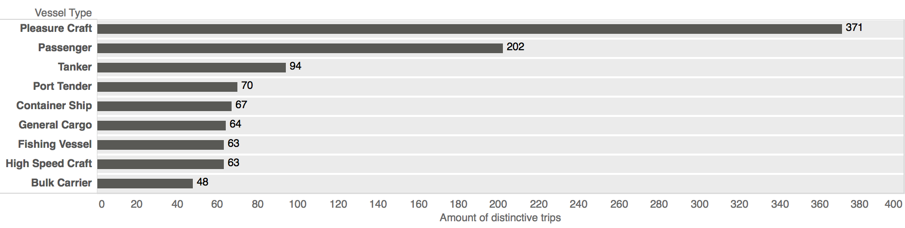

```{r message=FALSE, warning=FALSE}
library(tidyverse)
library(lubridate)
library(geosphere)
library(tools)
library(gridExtra)
library(RColorBrewer)
library(ggthemes)
library('Matrix')
source("define functions.r")
options(dplyr.show_progress = FALSE)
options(scipen = 999)
categories <- c("Bulk Carrier", "Fishing Vessel", "High Speed Craft", "General Cargo ", "Container Ship", "Port Tender", "Tanker", "Passenger", "Pleasure Craft")
```
### Importing and pre-processing the data
First we load two data sets: 

1. AIS measurements captured within a 15km radius of Las Palmas.
2. Vessel-information data.

During the import process we already remove invalid and insufficient
measurements (e.g. duplicate data). This affected aproximately 12% of the data 
imported. Each measurement is then labelled with a new position id to make each
data row uniquely identifiable (*POSID*).

*Note: (1) Had already seen some pre-processing in R and QGIS. (2) Was scraped
from Marinetraffic and then made tidy using regular expressions.*
```{r, echo=TRUE, message=FALSE, warning=FALSE, results=FALSE}
vesseldetails <- read_csv('dataset/in/df_vesseldetails_original.csv')
aisdata <- read_csv('dataset/in/df_1d_selection_restricted.csv') 
tmp_noimp <-  nrow(aisdata)
aisdata <- aisdata %>% 
  subset(select = -c(1,2)) %>% 
  filter(MMSI %in% vesseldetails$MMSI) %>%
  subset(!duplicated(select(.,MMSI,TIMESTAMP))) %>% 
  group_by(MMSI) %>% 
  filter(n() > 10) %>% 
  ungroup() %>%
  arrange(MMSI,TIMESTAMP) %>% 
  mutate(POSID = row_number(x = .$MMSI))
cat(' Number of AIS measurements available:',tmp_noimp,
    '\n','Number of valid AIS measurements imported:', nrow(aisdata))
```

```{r}
head(aisdata)
```


### Create tracks and detect trips
The plot below shows three different representations of the AIS data. In the 
'Points' plot on the left we see the orignal data representation: a collection 
of GPS coordinates pertaining to a particular vessel.

In the 'Tracks' plot in the center the points have been transformed into a 
navigationpath where segments are connected in chronological order. Moreover 
both for the overall track as well as each segment characteristic are computed. 
E.g. the duration or length of a segment. These transformations are implemented 
within the `Points2Trajectory()` function below.

On the right plot further transformations were carried out. Here a vessel's 
trajectory is broken up into two 'trips' which occured on two different days. 
The trip colored in red occured on the 5th of June 2014, while the trip colored 
in blue occured on the 26th of June 2014. This is necessary because not doing so
leads to  problems such as sudden jumps in the vessel-position (visible from the
straight diagonal line in the Tracks plot). The transformation from a  vessel 
trajectory to trips is implemented in the `Trajectory2Trips()` function  further
below. The functions goes even one step further and subdivides trips occuring at
different days into outbound and inbound trips.

```{r, echo=FALSE, message=FALSE, warning=FALSE}
tmp <- filter(aisdata, MMSI == 224548000, LON > -15.44 , LON < -15.37) %>% 
  mutate(daytrip = as.factor(day(TIMESTAMP)))
tmp_p1 <- ggplot(tmp) +
  geom_point(aes(LON, LAT)) + 
  ggtitle('Points') + coord_fixed()
tmp_p2 <- ggplot(tmp) + 
  geom_point(aes(LON, LAT)) + 
  geom_path(aes(LON, LAT)) + 
  ggtitle('Tracks') + coord_fixed()
tmp_p3 <- ggplot() + 
  geom_point(data = tmp, aes(LON, LAT, color = daytrip)) +
  geom_path(data = tmp, aes(LON, LAT, color = daytrip)) + 
  ggtitle('Trips') + theme(legend.position = 'none') + coord_fixed() +
  scale_colour_brewer(palette = "Set1")
plot_point_tracks <- grid.arrange(tmp_p1, tmp_p2, tmp_p3, ncol = 3, nrow = 1) 
# ggsave("figures/plot_point_tracks.png", plot = plot_point_tracks)
RemoveObjects('tmp')
```

Here we transform the point representation into a trajectory representation as 
explained before. Very importantly we calculate the duration of each segment on
the trajectory as well as the average speed and bearing. 
```{r, message=FALSE, warning=FALSE, results=FALSE}
Points2Trajectory <- function(df){
  df <- df %>% arrange(TIMESTAMP)  
  idx1 <- seq(1, nrow(df) - 1, 1)
  idx2 <- seq(2, nrow(df), 1) 
  startpoints <- slice(df,idx1) %>% select(START_LON = LON, START_LAT = LAT)
  endpoints <- slice(df,idx2) %>% select(END_LON = LON, END_LAT = LAT)
  start_time <- slice(df,idx1) %>% .$TIMESTAMP
  end_time <- slice(df,idx2) %>% .$TIMESTAMP
  data.frame(slice(df,idx1) %>% select(MMSI),
             slice(df,idx1) %>% select(START_POSID = POSID),
             slice(df,idx2) %>% select(END_POSID = POSID),
             TIME_START = start_time,
             TIME_END = end_time,
             startpoints,
             endpoints,
             DISTANCE = distCosine(startpoints, endpoints),
             BEARING = bearing(startpoints, endpoints),
             TIME_DIFF = as.numeric(end_time - start_time, units = "secs")
             ) %>% 
  mutate(AVG_SPEED = DISTANCE / TIME_DIFF,
         TIME_DIFF_MIN = round((TIME_DIFF/60)))
}
trajectories <- aisdata %>% group_by(MMSI) %>% 
  do(Points2Trajectory(.)) %>% as.data.frame()
head(trajectories)
```


#### Detect trips
We divide each vessel's trajectory into a collection of trips. We do this based 
on the time difference between subsequent location measurements. In other words,
if the time difference between two measurements exceeds a certain value, then it
is assumed that the current vessel's trip has ended and a new trip has started.
This may be the case when a vessel either leaves the port area or turns off its
AIS transmitter.

But first we must determine the time threshold above which a trajectory needs to
be split or not. We do this by plotting the proportion of time differences
observed between each measurement using a subselection of the data.

This subselection of data contains only vessels in the immediate proximity of
the port of Las Palmas. By doing so we are more likely to have data where the
time difference is unaffected by undesired factors (e.g. signal disturbances).
Nonetheless this subselecton covers 75% of the measurements in the data set.
(TODO insert ref on better signal near coasts) and therefore unbiased.


```{r, echo=FALSE, message=FALSE, warning=FALSE}
# Temporary subselection of data
tmp_trajectories_port <- trajectories %>%
  filter(START_LON > -15.45, START_LON < -15.37)  %>%
  filter(START_LAT > 28.1, START_LAT < 28.1507) %>%
  filter(END_LON > -15.45, END_LON < -15.37)  %>%
  filter(END_LAT > 28.1, END_LAT < 28.1507) %>%
  filter( (day(TIME_START) - day(TIME_END)) < 2 )  # To avoid day jumps.

# Discard uncommon measurements
tmp_counts <- tmp_trajectories_port  %>% 
  count(TIME_DIFF_MIN) %>%
  mutate(prop = n/sum(n)*100) %>% 
  filter(prop > .5)

# Plot time differentials
plot_tdiff = ggplot(data = tmp_counts) +
  geom_col(mapping = aes(x = TIME_DIFF_MIN, y = prop)) +
  scale_x_continuous(breaks = seq(1:32)) +
  ylim(0, 35) +
  labs(title = paste("Time difference between measurements. \nn = ", 
                     nrow(tmp_trajectories_port), 
                     'with',round(sum(tmp_counts$prop),1),'% of the data shown'), 
       x = "Time between subsequent measurements (minutes)", 
       y = "Proportion of data (%)") +
  geom_label(aes(label = paste(round(prop,1),'%'), x = TIME_DIFF_MIN, y = prop + 1 ),
             vjust = 0.5, size = 3, label.padding = unit(0.15, "lines")) +
  theme(panel.grid.major.x = element_blank(), 
        panel.grid.minor.x = element_blank(), 
        panel.grid.minor.y = element_blank())
plot_tdiff
# ggsave("figures/point-track-trips.png", plot = plot_tdiff)
# ExportObject(tmp_trajectories_port)
RemoveObjects('tmp')
```
The plot above shows in what time intervals the vessels position measurements
are updated as well as the proportion of measurements occurring at a given time
interval. For instance we can see that 32.5% of the measurements occur in 21
minute intervals. Overall for 96.1% of the sampled data less than 30 minutes
pass between subsequent measurements. *Footnote: Note that sampling rates that
occur in less than 0.5% of the sampled data were excluded.*

We can see that the most frequent time intervals are concentrated within a small 
range of values. In other words most position measurement occur within 2 minutes 
and 4 minutes or within 20 minutes and 24 minutes.

Importantly, 63% of measurements occur within a 20 to 24 minute interval. This
is in stark contrast to the nominal AIS reporting intervals which typically are
either every 3 minutes or every 10 minutes. (Source:
http://arundale.com/docs/ais/ais_reporting_rates.html). A possible reason for
this could be that the data provided by Greenpeace had been sampled down to
include fewer updates.

There are two takeaways from this. First, we set the time treshold to determine 
where to split the trajectory into separate trips at 30 minutes. Second, the 
rather long measurement intervals determine the machine learning methods that
can realistically be used for classifying vessels based on their navigation
data. For instance methods relying on the geometric properties of a trajectory
may be less suitable because sparse measurements also mean that the geometry of
a vessel will not be very well described.

Next we split the trajectory data into separate trips according to the 30 minute
time threshold we have just determined. For this we have written a function
`Trajectory2Trips()` which does this for us.

```{r}
Trajectory2Trips <- function(df){
  result <- c(1:nrow(df))
  # 30 Minute time threshold determined before in seconds
  threshold <- 30*60
  counter <- 1
  for (i in 1:nrow(df)) {
    if (df$TIME_DIFF[i] <= threshold){
      result[i] <- counter  
    }else{
      result[i] <- -1
      counter <- counter + 1
    }
  }
  data.frame(result)
}
```

We apply the `Trajectory2Trips()` function to the dataframe and save the result 
in a new dataframe `trips`. Now that the data is in the correct format we can 
carry out some exploratory data analysis.

Next we remove those segments were the trips have been split. We also remove all
trips with less than 2 segments because we found that those trips had too few
datapoints to be in any way insightful.
```{r}
trips <- trajectories %>% 
  # group_by(MMSI) %>% 
  do(Trajectory2Trips(.)) %>% 
  as.data.frame() %>% 
  select(result) %>% 
  cbind(trajectories)
colnames(trips)[1] <- "TRIP_ID"

# Remove invalid trips
trips <- filter(trips, TRIP_ID > -1)  
# Get id's of at least 5 segment trips
tmp_to_keep <- trips %>% count(TRIP_ID) %>% filter(n > 5) %>% .$TRIP_ID
trips <- filter(trips, TRIP_ID  %in% tmp_to_keep)
rm(tmp_to_keep)
```

#### Recoding vessel categories
As explained in the introduction a curated list of vesseltypes was used instead
of the crude vessel categorisation provided by the AIS devices themselves.
Furthermore the categorisation was further refined by recoding some of the
categories.
```{r}
vesseldetails$VESSEL_TYPE <- recode(vesseldetails$ship.type,
                                   "Sailing Vessel" = "Pleasure Craft",
                                   "Passengers Ship" = "Passenger",
                                   "Ro-Ro/Passenger Ship" = "Passenger",
                                   "Ro-Ro Cargo" = "Passenger",
                                   "Crude Oil Tanker" = "Tanker",
                                   "Oil Products Tanker" = "Tanker",
                                   "Chemical Tanker" = "Tanker",
                                   "Oil/Chemical Tanker" = "Tanker",
                                   "LPG Tanker" = "Tanker",
                                   "Fishing" = "Fishing Vessel")
# Let's also add the vessel.type column to the trips dataframe. 
trips <- left_join(trips, vesseldetails[,c('MMSI', 'VESSEL_TYPE')], by = 'MMSI')
head(trips)
```


### Feature Engineering
Vessel trajectories are not just some geometric shapes existing in a vacuum. 
First, they have specific properties relating to the vessel creating the 
trajectory. For instance the speed of the vessel across the trajectory or the 
time of travel. 

Second, they exist in spaces with their own semantics. For instance vessels 
often travel along sea lanes and they dock in harbours or specific docking 
areas. Because different type of vessels often dock at different locations
within a port and travel on different sea leanes such information is
particularly helpful within a vessel classification setting. Indeed previous
research has shown that adding domain knowledge to trajectory data can
significantly increase classification accuracy (Vries, 2012, p.87).

In this section I describe the feature engineering steps I undertook in order to
add domain knowledge to the trajectories and to extract intrinsic
trajectory-properties from the data.

#### Adding domain knowledge
The density maps I have described before show that vessels dock at differen 
locations within the port of Las Palmas. With the help of a overview plan from 
the port of Las Palmas the 15 semantic areas pictured below were defined. Areas 
such as area 3 and area 4 denote container docks where areas such as area 13 and
area 14 indicate port areas that are solely reserved to passenger and/or sailing
vessels. 

{width=100%}

The boundaries and their geographic coordinates were defined in a spreadsheet
and subsequently imported into R. Overlapping areas (e.g. area 1 and area 3)
were corrected using set operations. For each segment in the previously
generated `trips` dataframe we check if the segment is within in any of the
defined port areas. We record the results in a sparse matrix [#segments x #areas
] and export the data.

```{r, eval=FALSE, include=TRUE}
# Note this code is very slow (run time ~5 minutes), do not run but rather load
# the the sparse matrix in the next block. TODO: rewrite using for loop.
tmp_positions <-  c('START_LON', 'START_LAT', 'END_LON', 'END_LAT')
areas = read_csv('./dataset/in/areas.csv')
locmat_sparse <- apply(trips[tmp_positions],1, function(x){
  tmp_vec <- rep(0, nrow(areas))
  indeces <- intersect(filter(areas, lon_left <= x['START_LON'],
                              x['START_LON'] <= lon_right,
                              lat_bottom <= x['START_LAT'],
                              x['START_LAT'] <= lat_top) %>% .$area_code,
                       filter(areas, lon_left <= x['END_LON'],
                              x['END_LON'] <= lon_right,
                              lat_bottom <= x['END_LAT'],
                              x['END_LAT'] <= lat_top) %>% .$area_code)
  tmp_vec[indeces] <- 1
  tmp_vec
  }) %>% t %>% Matrix(locmat, sparse = TRUE)

# Fix area 3 which overlaps area 1. (avoid double counting)
locmat_sparse[,3] <- (locmat_sparse[,3] - locmat_sparse[,1])
locmat_sparse[locmat_sparse[,3] == -1,3] <- 0
writeMM(locmat_sparse, file = './dataset/in/locmat_sparse.txt')
rm(tmp_positions)
```

Once we know which segments of a vessels trips are in which area we can compute
for each vessel, for each trip the total time spent in the respective areas
defined.
```{r warning=FALSE, message=FALSE}
# Load areas and locmat again (previous codeblock is usually not run).
areas <- read_csv('./dataset/in/areas.csv')
locmat_sparse <- readMM(file = './dataset/in/locmat_sparse.txt')

# For each trip compute time spent in each area, return list of df. TODO: change into for loop.
time_in_area_list <- apply(locmat_sparse, 2, function(x)
  trips %>% 
    select(TRIP_ID, MMSI, TIME_DIFF, START_POSID) %>%
    slice(which(x != 0)) %>% 
    group_by(TRIP_ID) %>% 
    summarise(total_time = sum(TIME_DIFF)) %>% 
    data.frame())

# In the previous list of df rename the total_time column.
time_in_area_list <- lapply(seq_along(time_in_area_list), function(x){
  df <- data.frame(time_in_area_list[x])
  names(df)[-1] <- paste('area',x,sep = '_')
  df
})

# Join all those list together to get 1df with total time spent in each area.
time_in_area <- time_in_area_list %>%
  Reduce(function(df1,df2) full_join(df1, df2, by = "TRIP_ID"), .) %>% 
  arrange(TRIP_ID)
rm(time_in_area_list)
head(time_in_area)
ExportObject(time_in_area)
```

It is also useful to know which segments of a vessel's trips are outside the 
port area and which ones are inside. For instance when comparing the average 
speed across different types of vessels it makes sense to do this only on those 
parts of a trajectory that are outside the port area. The reason bein that
within the port areas all vessel are required to abide to speed limits and
therefore navigate at similar speeds. In contrast on open water vessels are
allowed to navigate at their full speed and consequently allow us to
discriminate between high speed vessels and slow sailing vessels just to mention
a few. For this purpose we create a new binomial feature in `trips` indicating which
segments are within the port area and which outside.
```{r}
trips <- mutate(trips, IN_PORT = locmat_sparse[,15])
```

#### Computing Vessel statistics
```{r}
trips_stats <- group_by(trips, TRIP_ID) %>% 
  summarize(duration_total_minutes = sum(TIME_DIFF)/60,
            duration_segment = mean(TIME_DIFF),
            speed_avg = mean(AVG_SPEED),
            speed_max = max(AVG_SPEED),
            distance_total = sum(DISTANCE),
            distance_segment = mean(DISTANCE),
            time_start = min(TIME_START),
            time_end = max(TIME_END))
```

### Exploratory Analysis
In this section we carry out the exploratory data analysis. The goal is on the 
one hand to get a better feel of the data, on the other hand to answer some
preliminary but nonetheless important question.

#### Which vessel types carry out the greatest number of trips?

Since the purpose of this research is to classify vessels we first need to find
out for which type of vessels there is enough data to work with. To do that we
count the number of unique trips per vessel-type. 

Below we have plotted the total number of trips for each vessel-type for which 
more than 48 trips have been recorded. In total we have 8 types of vessels that have carried out at least 48 trips over the entire time period recorded in the 
dataset. Pleasure crafts which includes small private sailing vessels as well as
private vessels carry out the greatest number of trips whereas bulk carriers
carry out the smallest number of trips.
{width=100%}

#### Do vessels travel at different speeds?
```{r, echo=FALSE, message=FALSE}
plot_speeds <- filter(trips, VESSEL_TYPE %in% categories) %>% 
  ggplot() +
  geom_boxplot(mapping = aes(x = VESSEL_TYPE, y = AVG_SPEED),
               outlier.alpha = 0.1, outlier.size = 1) +
  labs(title = 'Distriubution of average speed per segment.',
       x = 'Vessel Type', y = 'Average Speed (m/s)') +
  facet_wrap(~ IN_PORT, nrow = 2) +
  coord_flip()
plot_speeds
ggsave("figures/plot_speeds.png", plot = plot_speeds)
```

#### Export all data
```{r}
write_csv(trajectories, path = './dataset/out/trajectories.csv')
write_csv(vesseldetails,'./dataset/out/vesseldetails.csv')
write_csv(trips,'./dataset/out/trips.csv')
write_csv(trips,'./dataset/out/trips_stats.csv')

```


**Average Trip Duration**

```{r}

# Check how many datapoints are outside port

# For those trips check average speed, therefore export col 15 from loc matrix


# **Average Speed/Max/Min**
```


